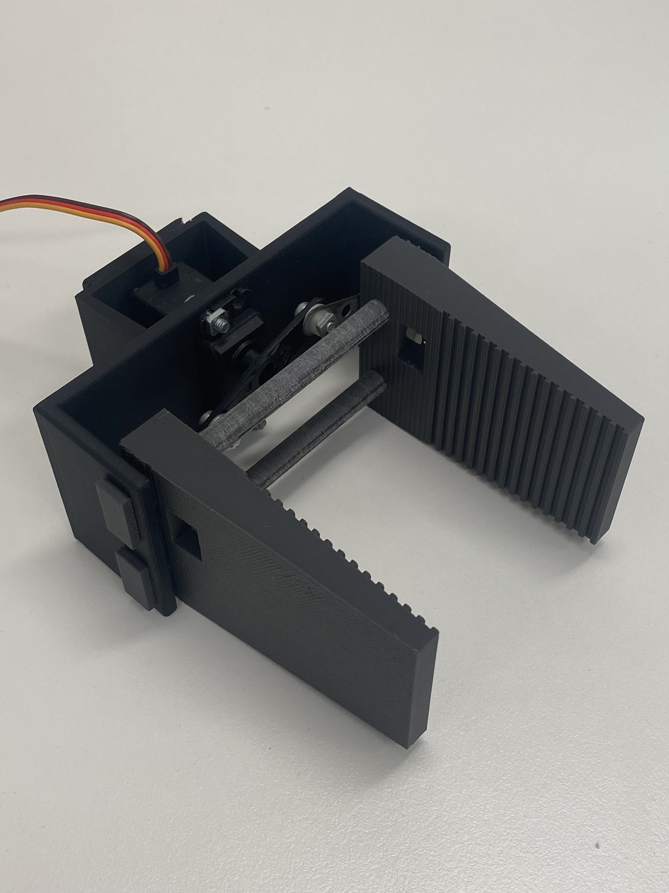
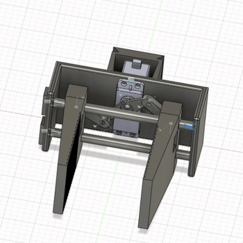

# UR5e Item Sorter
Item Picker for the UR5e specifically built for use in the MTRN4231 labs.

# Table of Contents
-# Include a Table of Contents at the start of your README (this can be auto-generated). 

# Project Overview

## Customer Problem
A small-scale local manufacturing client requires a robotic solution to automate the sorting and organisation of small, packaged components along an assembly line. Currently, workers manually identify, pick, and place these components into designated trays based on visual characteristics such as colour and shape. The manual process of sorting is bottlenecking the assembly line with insufficient output and excessive errors, as well.

## Robot Functionality
Our product is an UR5e robotic system that autonomously identifies, picks, and sorts objects from a conveyor or workspace into correct storage bins, based on visual classification. This system aims to improve throughput, reduce labour fatigue, and increase sorting accuracy while maintaining safe operation within the defined workspace.

The system is designed to operate in a semi-structured environment with objects on a relatively flat surface. A fixed Intel Realsense (or alternative RGBD) camera will provide a real-time view of the workspace. 

The simplified workflow will consist of: 
- Using a trained machine learning model, the RGBD camera will detect, and classify objects and bins on the work surface. 
- Determining the 3D pose of each object detected using calibrated depth camera points
- Plan and execute pick-and-place trajectories using MoveIt
- Move to and grip each object using the custom servo-actuated gripper end-effector
- Move to and drop objects into the corresponding sorting bin

## Demo Video
(OneDrive Link?)

# System Architecture

## rqt Graph

## Closed-Loop System Behaviour

## Custom messages and services
### LabelledPose.msg
Message type to represent individual detected objects and their pose. Used in brain, perception and visualisation.
<pre>
string label
string colour
string shape
geometry_msgs/Pose pose
</pre>
### LabelledPoseArray.msg
Message type to represent a full set of LabelledPose messages. Used in brain, perception and visualisation.
<pre>
std_msgs/Header header
LabelledPose[] poses
</pre>

### Move.srv
<pre>
bool grasp
geometry_msgs/Pose pose
---
bool success
string message
</pre>
### TransformLookup.srv
<pre>
geometry_msgs/PoseStamped pose
string to_link
---
bool success
geometry_msgs/PoseStamped pose
</pre>
### TransformLookupArray.srv
<pre>
geometry_msgs/PoseStamped[] poses
string to_link
---
bool success
geometry_msgs/PoseStamped[] poses
</pre>

# Technical Components
## Computer Vision
The vision pipeline begins with a pre-existing realsense camera node which continously publishes the colour image, aligned depth image, intriniscs from the camera, as well as some helpful transforms.

The perception node subscribes to both image topics and activates the main logic as a callback whenever receiving a new colour image. When recieved the node;
- Runs the colour image through our custom YOLO model to find objects within view. 
- Annotate a copy of the original image with the model output for visualisation.
- For each detection, we check its confidence is above the expected threshold.
- Find the object's exact presence in the bounding box using colour thresholding with the detected objects expected tones.
- Use this colour mask, in combination with the corresponding points in the depth image, to transform all points in the detection into 3d space from the camera perspective.
- Take an average of all these points to output a centroid of the object in 3d space.
- ~~The orientation of the object is approximated via taking a sample of points across the object, and producing a plane approximation of them which can output yaw, pitch, roll to be converted into quaternion.~~ 
- If the object is meant to be unique (i.e. a bin or tray), we keep track of the observation with the highest confidence to ensure only this one is published in final message.
- Build custom message type LabelledPoseArray with all processed observations and publish as 'camera/objects/labelled_pose_array'

The 'camera/objects/labelled_pose_array' is subscribed to by the brain and visualiser nodes. In the brain the message is;
- Processed with all poses being transformed from the camera frame to the base_link frame. 
- All objects are seperated out into objects to be sorted and bins, and matched via shape.
- All objects to be sorted are then finally added to a queue

In the visualiser node, the message is taken in and transformed into a MarkerArray with custom stl meshes describing each tpye of observable object.

## Custom End-Effector
The custom end effector designed is a parallel 2-jaw gripper, chosen for its high precision, predictable grasp point, and reliable performance during manipulation tasks. Its mechanism uses a reverse-motion linkage that converts the rotational output of a servo into linear travel, allowing both jaws to slide smoothly along dual guide rods and maintain strict parallelism. Control was handled by a Teensy 4.1, with the servo connected directly to one of its PWM pins. The Teensy received simple serial commands from an Arduino bridge node, which acted as the ROS interface. The central brain node published “open” and “close” commands to the topic monitored by the bridge whenever the robot reached either the grasping pose or the bin-drop pose. Since no gripper state was published back into ROS, the system operated open-loop, relying on the coordination between the Brain node and the arm motion planner to ensure timing was correct.

The following images and diagrams illustrate the design.

  

<video width="300" controls>
  <source src="images/gripper_moving.mp4" type="video/mp4">
</video>

## System Visualisation
The system uses Rviz2 for visualisation ensuring that any users are able to clearly observe the state of the workspace and the robot. Visualised in our custom Rviz config are:
- The UR5e robot
- Custom End-effector attached to UR5e wrist. Visually displays whether the clamp is open or closed.
- Workspace Surface and other safety planes visualised as collision objects.
- RealSense Camera visualised via its transform
- The camera colour image with machine learning model output displayed, including bounding boxes, classifications and confidences for each detection. 
- All objects and buckets visualised in the 3d space via custom markers utilising stl meshes.

[Include pic of final RViz Config]

## Closed-Loop Operation

# Installation and Setup

## **Moveit Setup Instructions**
A slightly modified source install of moveit is provided for MTRN4231. To use it follow the build instructions:

1. Install Dependencies <pre>sudo apt install python3-rosdep
sudo rosdep init
rosdep update
sudo apt update
sudo apt dist-upgrade
sudo apt install python3-vcstool
sudo apt install python3-colcon-common-extensions
sudo apt install python3-colcon-mixin
colcon mixin add default https://raw.githubusercontent.com/colcon/colcon-mixin-repository/master/index.yaml
colcon mixin update default
sudo apt update && rosdep install -r --from-paths . --ignore-src --rosdistro $ROS_DISTRO -y
</pre>
2. Build the workspace <pre>cd ws_moveit2
colcon build --mixin release</pre>

## **UR Setup Instructions**
The ur_robot_driver needs to be installed to run the robot and the sim:

<pre>sudo apt install ros-humble-ur</pre>

Run robot calibration before running anything else:

<pre>ros2 launch ur_calibration calibration_correction.launch.py \
robot_ip:=&lt;robot_ip&gt; target_filename:="${HOME}/my_robot_calibration.yaml"</pre>

## Hardware setup

### UR5e 

### RealSense Camera

### Teensy & End Effector
Setup steps for teensy and end effector for UR5e:
1. Attach end effector to ur5e connecting mount
2. Connect teensy to pc usb port
3. Connect servo wires to UR5e using phoenix connectors and custom mount
4. Connect UR5e desktop power/interface box to teensy to complete circuit for servo

## Dependencies

## System Variables and Calibration

# Running the System

## **Running in ROS**
A setup script is provided in **setup.bash**. To use it run: <pre>source setup.bash</pre>

## **Running in Simulation**
Simulation uses gazebo and is sourced from the directory https://github.com/UniversalRobots/Universal_Robots_ROS2_Gazebo_Simulation
To install dependencies: <pre>cd ur_gazebo/src
rosdep update && rosdep install --ignore-src --from-paths . -y</pre>
Then build:
<pre>colcon build --symlink-install</pre>
This allows us to launch with the provided launch file to test:
<pre>ros2 launch ur_simulation_gazebo ur_sim_moveit.launch.py</pre> or to launch without the moveit plugin
<pre>ros2 launch ur_simulation_gazebo ur_sim_control.launch.py</pre>

## Launch commands

## Expected outputs

## Common Troubleshooting

# Results and Demonstration

## Final Result (inc. quantitative result)

## Compare against design goals

# Discussion and Future Work
## Iterations and Development Challenges
### Object Detection
The computer vision component of our project underwent various distinct iterations with various methods before we settled on a YOLO-based solution.

In early designs, it was predicted that colour thresholding and contour approximations via opencv would be sufficient to distinctly identify and classify objects. While testing with external data showed this was possible, when testing in the workspace this approach failed. While thresholding was able to accurately find objects, contour approximation was not able to distinguish faces sufficiently to classify shapes. The 2nd iteration replaced the opencv contour approximation with a pointcloud approximation but this failed for similar reasons unable to accurately model the object to infer information.

The next solution was to utilise unique Aruco markers for each type of object. This solution also allowed grabbing a rotational orientation output directly from the Aruco marker. This solution worked fairly consistently with the bins however did fail to detect in certain positions. It was worse however for objects whose markers had to be even smaller and could not consistently be located especially if the markers could not be kept flat, which was a painful impossiblity for the curved shapes. While simply using colour masking for objects and keeping Aruco markers simply for the bins was considred, it was ultimately rejected as the goal of the project was to be able to sort by shape and colour, and the long processing time of each callback of ~1 sec that was insufficient for proper realtime use.

This is how we landed on a machine learning based solution. While it did not provide the easy access to orientation that Aruco markers provided, it gave consistent detections all the time. And this solution would be able to function for most manners of potential objects designs including more complex ones then current simple shapes.

### MoveIt

## Novelty of Existing Solution

## Directions for Future Work
### YOLO model
Our model used in perception was trained on a limited dataset. Given more time and resources, this can be trained to become more robust and reliable. 

Future work on this model, also becomes a necessity should any additional types of objects or bins want to be added for use with this system.

### Gripper
The gripper in its current form has significant room for improvement, despite working reliably. While all components were 3D printed at 10% infill for durability, the inherent limitations of FDM printing such as imprecise hole tolerances and rough surface finishes, made assembly challenging. Several parts required manual drilling and sanding to achieve smooth travel along the guide rods. Although the jaws include grooved contact surfaces, they do not consistently achieve a secure grasp, so adding a higher-friction material such as rubber is planned to improve tactility. Additionally, the interface between the jaws and the guide rods can be refined to reduce friction and improve sliding performance, leading to more reliable and repeatable motion.
### Visualisation

### Closed-Loop Behaviour

# Contributors and Roles
## Julian Britton
## Bryson Chen
Bryson's key contributions revolves around the design and integration of the custom end-effector into the physical robot and ROS architecture. Bryson designed the parallel jaw gripper's components in fusion 360, and used those STL files to define the robot in a URDF file for visualisation in RViz. Bryson had also worked on creating launch files for easier use. 3
## Matthew Viegas

# Repository Structure

## sorter_ws
The main workspace for the whole item sorter system
### src/brain
Package that acts as the main brain for the system. Determining based on perception and moveit responses the next closed-loop action.
### src/interfaces
Houses all custom message and service definitions
### src/moveit_config

### src/moveit_planner

### src/perception
Package that handles all computer vision tasks for detecting, classifying and locating objects and bins in the camera frame
### src/robot_description
Package that holds custom end-effector description for visualisation
### src/sys_viz
Package that handles launching all needed nodes, and custom rviz2 configuration. Also contains launch files for starting the system.
### src/teensy_pkg
Package for interfacing with custom end-effector via teensy
### src/transforms
Package for handling all additionnal ros transformer frames and providing a service for mapping poses between frames
### src/visualisation
Package for handling the visualisation of all objects and bins as custom stl markers in Rviz2 
## unused_pkgs
Houses old packages no longer used in final solution.
### object_detect
Old perception package which used Aruco markers, colour thresholding and size approximation to classify and locate objects. This did NOT use machine learning. For more info as to why it was removed see [Link to discussion]
## ur_gazebo
## ws_moveit2

# References and Acknowledgements
- UR5e model and gazebo
- MoveIt
- Rviz2
- Realsense package

