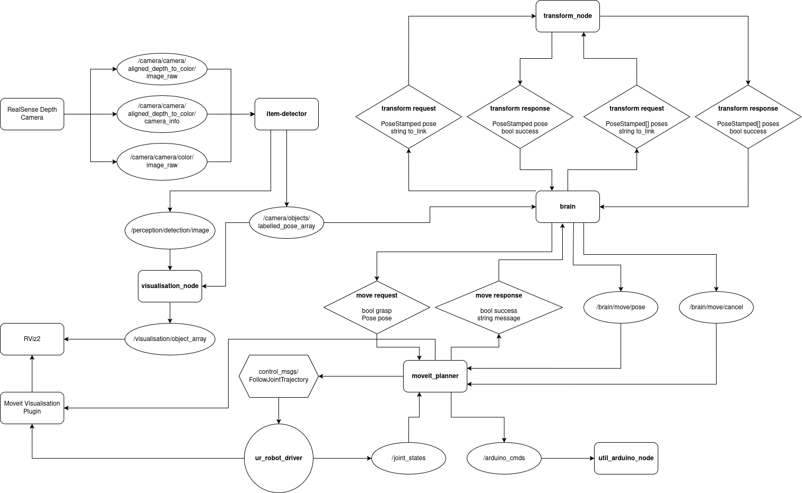
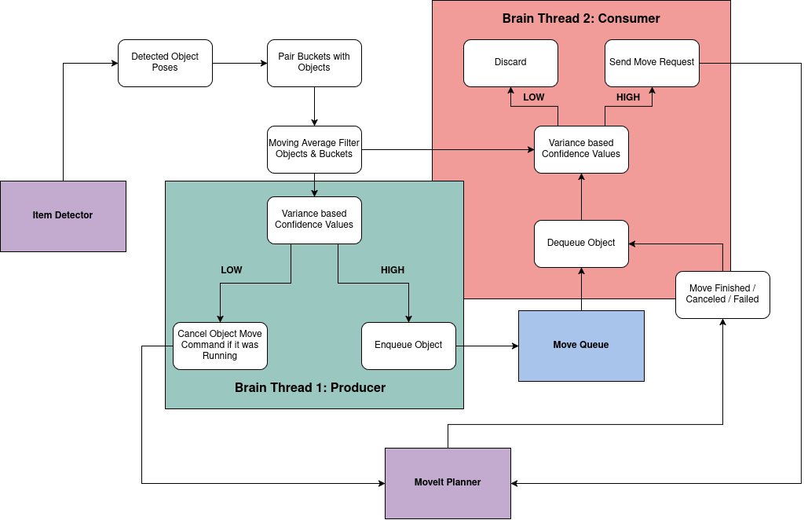
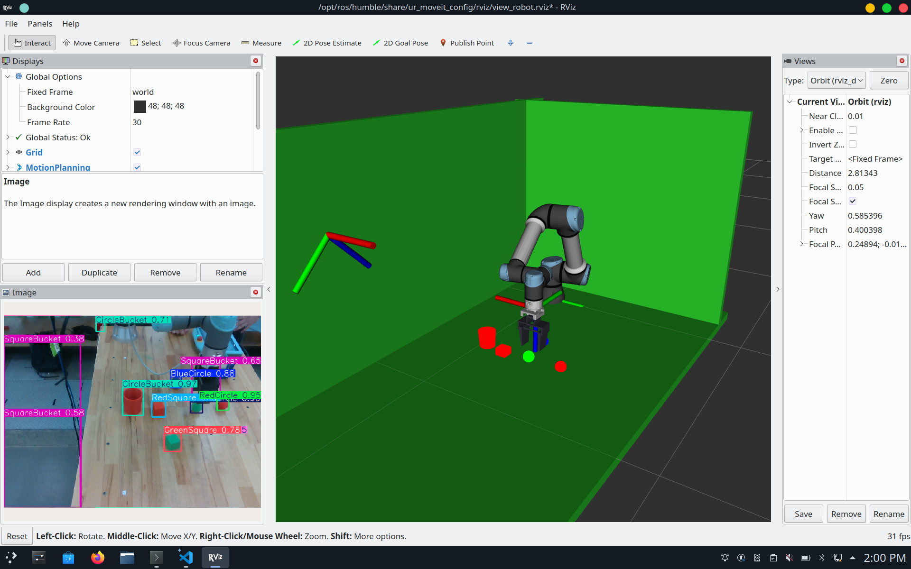
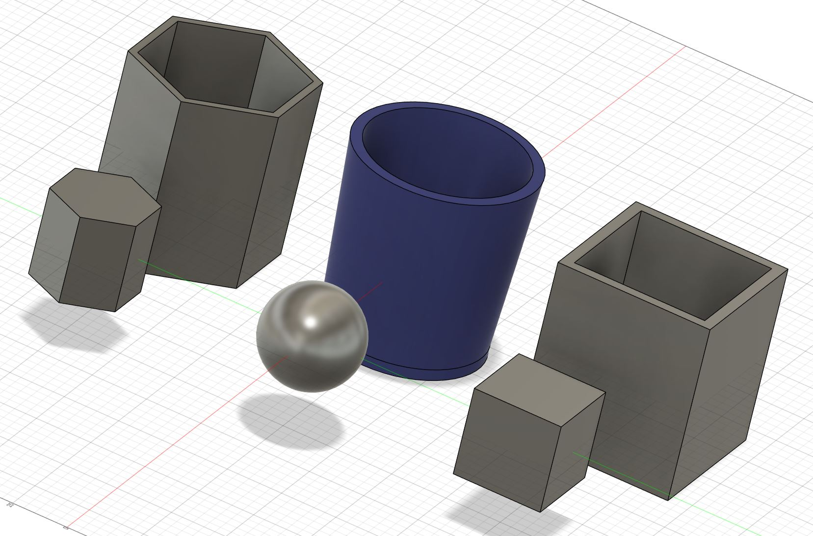

# UR5e Item Sorter
Item Picker for the UR5e specifically built for use in the MTRN4231 labs.

# Table of Contents
- [UR5e Item Sorter](#ur5e-item-sorter)
- [Table of Contents](#table-of-contents)
- [Project Overview](#project-overview)
  - [Customer Problem](#customer-problem)
  - [Robot Functionality](#robot-functionality)
  - [Demo Video](#demo-video)
- [System Architecture](#system-architecture)
  - [ROS Graph](#ros-graph)
  - [System Behaviour State Diagram](#system-behaviour-state-diagram)
  - [Custom messages and services](#custom-messages-and-services)
    - [LabelledPose.msg](#labelledposemsg)
    - [LabelledPoseArray.msg](#labelledposearraymsg)
    - [Move.srv](#movesrv)
    - [TransformLookup.srv](#transformlookupsrv)
    - [TransformLookupArray.srv](#transformlookuparraysrv)
- [Technical Components](#technical-components)
  - [Computer Vision](#computer-vision)
    - [YOLO training](#yolo-training)
  - [Custom End-Effector](#custom-end-effector)
  - [System Visualisation](#system-visualisation)
- [Installation and Setup](#installation-and-setup)
  - [System Requirements](#system-requirements)
  - [Installation](#installation)
  - [**Moveit Setup Instructions**](#moveit-setup-instructions)
  - [**UR5e Setup Instructions**](#ur5e-setup-instructions)
  - [**RealSense D435 Instructions**](#realsense-d435-instructions)
  - [Hardware setup](#hardware-setup)
    - [UR5e](#ur5e)
    - [RealSense Camera](#realsense-camera)
    - [Teensy \& End Effector](#teensy--end-effector)
  - [Robot Calibration](#robot-calibration)
  - [New Object Calibration](#new-object-calibration)
    - [YOLO Model](#yolo-model)
    - [Perception (/sorter\_ws/src/perception)](#perception-sorter_wssrcperception)
    - [Visualisation (/sorter\_ws/src/visualisation)](#visualisation-sorter_wssrcvisualisation)
    - [Brain (/sorter\_ws/src/brain)](#brain-sorter_wssrcbrain)
  - [List of Dependencies](#list-of-dependencies)
    - [ROS Dependencies](#ros-dependencies)
    - [C++](#c)
    - [Python](#python)
- [Running the System](#running-the-system)
  - [**Running on the Real UR5e**](#running-on-the-real-ur5e)
  - [**Running in Simulation**](#running-in-simulation)
  - [Launch commands](#launch-commands)
  - [Expected outputs](#expected-outputs)
  - [Common Troubleshooting](#common-troubleshooting)
- [Results](#results)
- [Discussion and Future Work](#discussion-and-future-work)
  - [Iterations and Development Challenges](#iterations-and-development-challenges)
    - [Object Detection](#object-detection)
    - [MoveIt](#moveit)
  - [Novelty of Existing Solution](#novelty-of-existing-solution)
  - [Directions for Future Work](#directions-for-future-work)
    - [Architecture Reworks](#architecture-reworks)
    - [YOLO model](#yolo-model-1)
    - [Perception](#perception)
    - [Gripper](#gripper)
    - [Visualisation](#visualisation)
    - [Closed-Loop Behaviour](#closed-loop-behaviour)
- [Contributors and Roles](#contributors-and-roles)
  - [Julian Britton](#julian-britton)
  - [Bryson Chen](#bryson-chen)
  - [Matthew Viegas](#matthew-viegas)
- [Repository Structure](#repository-structure)
  - [sorter\_ws](#sorter_ws)
    - [src/brain](#srcbrain)
    - [src/interfaces](#srcinterfaces)
    - [src/moveit\_config](#srcmoveit_config)
    - [src/moveit\_planner](#srcmoveit_planner)
    - [src/perception](#srcperception)
    - [src/robot\_description](#srcrobot_description)
    - [src/sys\_viz](#srcsys_viz)
    - [src/teensy\_pkg](#srcteensy_pkg)
    - [src/transforms](#srctransforms)
    - [src/visualisation](#srcvisualisation)
  - [unused\_pkgs](#unused_pkgs)
    - [object\_detect](#object_detect)
  - [ur\_gazebo](#ur_gazebo)
  - [ws\_moveit2](#ws_moveit2)
- [References and Acknowledgements](#references-and-acknowledgements)


# Project Overview
## Customer Problem
A small-scale local manufacturing client requires a robotic solution to automate the sorting and organisation of small, packaged components along an assembly line. Currently, workers manually identify, pick, and place these components into designated trays based on visual characteristics such as colour and shape. The manual process of sorting is bottlenecking the assembly line with insufficient output and excessive errors, as well.

## Robot Functionality
Our product is an UR5e robotic system that autonomously identifies, picks, and sorts objects from a conveyor or workspace into correct storage bins, based on visual classification. This system aims to improve throughput, reduce labour fatigue, and increase sorting accuracy while maintaining safe operation within the defined workspace.

The system is designed to operate in a semi-structured environment with objects on a relatively flat surface. A fixed Intel Realsense (or alternative RGBD) camera will provide a real-time view of the workspace. 

The simplified workflow will consist of: 
- Using a trained machine learning model, the RGBD camera will detect, and classify objects and bins on the work surface. 
- Determining the 3D pose of each object detected using calibrated depth camera points.
- Plan and execute pick-and-place trajectories between objects and respective bins using MoveIt.
- Move to and grip each object using the custom servo-actuated gripper end-effector.
- Move to and drop objects into the corresponding sorting bin.
- Maintaing closed-loop behaviour by checking validity of current movement trajectories using computer vision.
- Displaying the current state of the system and trajectories using RViz2. 

## Demo Video
Demo videos are availble [HERE](https://unsw-my.sharepoint.com/:f:/g/personal/z5308662_ad_unsw_edu_au/EkcEuQ6GF6NBoAji4lgktqYBNZ-D3-GuiaB03AXQboohSQ?e=0i0dxh "ITEM SORTER DEMO VIDEOS")

# System Architecture
The item-sorting system comprised of the following packages:
  1. Perception
  2. Visualisation
  3. Transforms
  4. Brain
  5. MoveIt Planner
  6. Teesny Package
  7. Robot Description
  8. Sys Viz
  9. Interfaces

The prescribed functionality and included nodes for each package are outlined as follows:

**Perception**

The percepton package has 2 nodes included. An **item-detector**, and **test-detector** node. The **item-detector** node receives color and aligned depth images from the realsense camera. It performs computer vision operations using YOLO and colour masking segmentation to produce depth estimates for detected objects and publishes the detected poses with labels.

The **test-detector** node is a test node that can be used when running in simulation. It is a rudimentary replacement for the **item-detector** that publishes pre-determined objects. This allows for basic tests to be run on the system as a whole in a simulated environment.


**Visualisation**

The visualisation package contains the **visualisation_node** and some STL meshes for the detected objects. It's role is to publish and keep state for a MarkerArray which contains each detected object, and the buckets.


**Transforms**

The **transforms** package is the interface with TF2. It has 2 open service calls. One denoted as '/pose_lookup' takes a PoseStamped and desired transform frame, performs the transform lookup and returns the transformed pose. Another, denoted as '/pose_lookup_array' handles the same task but for batches of poses which have the same transform frame.


**Brain**

The **brain** package contains the **brain** node. It receives object poses and labels from the perception nodes and runs the underlying logic to decide what the robot should do.


**MoveIt Planner**

The **MoveIt Planner** package receives move requests from the **brain** on the '/moveit_planner/move' service, interfaces with MoveIt, and publishes commands to the arduino gripper interface. The actions of the planning node and the brain node are tightly interlinked.


**Teensy Package**

The **teensy package** exposes the serial inteface of the Teensy used to control the servo motors on the gripper. It subscribes to the '/arduino_cmds' topic and passes commands from this topic to the serial interface.


**Robot Description**

The **robot description** package provides the visualisation description for the robot arm in RViz. Specifically it adds the sorting gripper to the visualised arm. This visualisation description is used by the Moveit Visualisation plugin.


**Sys Viz**

Contrary to the **Sys Viz** name, this package contains launch files for the system.


**Interfaces**

This package contains the custom ROS interfaces used in the system.


## ROS Graph



## System Behaviour State Diagram
The key behaviour for the item-sorter is it's closed loop logic shown. As labelled object poses are passed from the Item Detector, they are sorted in the brain node which stores a moving average filter for each object that has been detected. The brain runs 2 threads: a producer and a consumer that read the confidence values of this moving average for each object-bucket pairing (these are calculated from the normalised variance of the moving average). The producer decides to enqueue high confidence pairings and signals the planner to cancel the current command if it was for a given low confidence pairing. 

The consumer thread dequeues each pairing, double checks its confidence is still good after the dequeue, then sends a move command to the planner node. It will do this in a loop, waiting for the moveit node to finish, cancel, or fail its previous movement.



## Custom messages and services
### LabelledPose.msg
Message type to represent labelled, detected objects and their pose. Used in brain, perception and visualisation.
```
string label
geometry_msgs/Pose pose
```
### LabelledPoseArray.msg
Message type to represent a full set of LabelledPose messages. Used in brain, perception and visualisation.
```
std_msgs/Header header
LabelledPose[] poses
```

### Move.srv
The **MoveIt Planner** node exposes a service using this service description. The *pose* is a goal pose for the planner to reach, *grasp* denotes to the planner whether it should grasp or ungrasp at the end of its path. The response contains a success bool and an error message on failure.
```
bool grasp
geometry_msgs/Pose pose
---
bool success
string message
```
### TransformLookup.srv
This service is exposed by the **transform node** to perform transform lookups between frames. The request contains the pose to be transfromed and a frame id *to_link* to transform to. The response has a success boolean and the transformed pose if succesful.
```
geometry_msgs/PoseStamped pose
string to_link
---
bool success
geometry_msgs/PoseStamped pose
```
### TransformLookupArray.srv
As for TransformLookup but for batches of poses from the same starting frame to the same destination frame.
```
geometry_msgs/PoseStamped[] poses
string to_link
---
bool success
geometry_msgs/PoseStamped[] poses
```

# Technical Components
## Computer Vision
The vision pipeline begins with a pre-existing realsense camera node which continously publishes the colour image, aligned depth image, intriniscs from the camera, as well as some helpful transforms.

The perception node subscribes to both image topics and activates the main logic as a callback whenever receiving a new colour image. When recieved the node;
- Runs the colour image through our custom YOLO model to find objects within view. 
- Annotate a copy of the original image with the model output for visualisation.
- For each detection, we check its confidence is above the expected threshold.
- Find the object's exact presence in the bounding box using colour thresholding with the detected objects expected tones.
- Use this colour mask, in combination with the corresponding points in the depth image, to transform all points in the detection into 3d space from the camera perspective.
- Take an average of all these points to output a centroid of the object in 3d space.
- ~~The orientation of the object is approximated via taking a sample of points across the object, and producing a plane approximation of them which can output yaw, pitch, roll to be converted into quaternion.~~ (REMOVED DUE TO INACCURACY)
- If the object is meant to be unique (i.e. a bin or tray), we keep track of the observation with the highest confidence to ensure only this one is published in final message.
- Build custom message type LabelledPoseArray with all processed observations and publish as 'camera/objects/labelled_pose_array'

The 'camera/objects/labelled_pose_array' is subscribed to by the brain and visualiser nodes. In the brain the message is;
- Processed with all poses being transformed from the camera frame to the base_link frame. 
- All objects are seperated out into objects to be sorted and bins, and matched via shape.
- All objects to be sorted are then finally added to a queue

In the visualiser node, the message is taken in and transformed into a MarkerArray with custom stl meshes describing each tpye of observable object.

### YOLO training
The model was trained utilising the free version of Roboflow, that allowed the team to collaboratively annotate 400 varying images. To make our model more robust to differences in camera and environment, we used augmentations including flipping, rotation, image shearing, saturation, exposure, blur and camera gain that took our original set from 400 to 1020 training images. While this makes it robust to slight changes in similar environments if the objects or the wooden table are modified at all it could cause significant decrease in classification confidence. If not using identical objects and bins, retraining a new model will be required.

## Custom End-Effector
The custom end effector designed is a parallel 2-jaw gripper, chosen for its high precision, predictable grasp point, and reliable performance during manipulation tasks. Its mechanism uses a reverse-motion linkage that converts the rotational output of a servo into linear travel, allowing both jaws to slide smoothly along dual guide rods and maintain strict parallelism. Control was handled by a Teensy 4.1, with the servo connected directly to one of its PWM pins. The Teensy received simple serial commands from an Arduino bridge node, which acted as the ROS interface. The central brain node published “open” and “close” commands to the topic monitored by the bridge whenever the robot reached either the grasping pose or the bin-drop pose. Since no gripper state was published back into ROS, the system operated open-loop, relying on the coordination between the Brain node and the arm motion planner to ensure timing was correct.

The following images and diagrams illustrate the design.
<div align="center">
  
</div>


## System Visualisation
The system uses Rviz2 for visualisation ensuring that any users are able to clearly observe the state of the workspace and the robot. Visualised in our custom Rviz config are:
- The UR5e robot
- Custom End-effector attached to UR5e wrist. Visually displays whether the clamp is open or closed.
- Workspace Surface and other safety planes visualised as collision objects.
- RealSense Camera visualised via its transform
- The camera colour image with machine learning model output displayed, including bounding boxes, classifications and confidences for each detection. 
- All objects and buckets visualised in the 3d space via custom markers utilising stl meshes.

<div align="center">
  
  
</div>
<div align="center">
  
</div>
<div align="center">
  
</div>

# Installation and Setup

## System Requirements
This project requires the following:
  * Operating System: Ubuntu 22.04.5 LTS (Jammy Jellyfish).
  * ROS2 Humble. Follow the instructions [here](https://docs.ros.org/en/humble/Installation/Ubuntu-Install-Debs.html) to install.

## Installation

The item sorter uses an Intel RealSense depth camera, a Universal Robots UR5e arm, and a Teensy to control the gripper. Each of these requires external libraries to be installed. Install them **sequentially** as per the following instructions.


## **Moveit Setup Instructions**
To calculate robot arm trajectories MoveIt is used. It is built in it's own directory. To build:

1. Install Dependencies <pre>sudo apt install python3-rosdep
sudo rosdep init
rosdep update
sudo apt update
sudo apt dist-upgrade
sudo apt install python3-vcstool
sudo apt install python3-colcon-common-extensions
sudo apt install python3-colcon-mixin
colcon mixin add default https://raw.githubusercontent.com/colcon/colcon-mixin-repository/master/index.yaml
colcon mixin update default
sudo apt update && rosdep install -r --from-paths . --ignore-src --rosdistro $ROS_DISTRO -y
</pre>
2. Build the workspace. If you have more than 16Gb of system RAM:<pre>cd ws_moveit2
colcon build --mixin release</pre>
Less than 16Gb of system RAM:<pre>cd ws_moveit2
colcon build --mixin release --executor sequential</pre>


## **UR5e Setup Instructions**
The Universal Robots libraries need to be installed to drive the UR5e arm and the sim:

<pre>sudo apt install ros-humble-ur</pre>


## **RealSense D435 Instructions**
Install the depth camera drivers and ros wrapper:<pre>sudo apt install ros-humble-librealsense2* ros-humble-realsense2-*</pre>
### Python Dependencies
To install the python dependencies: <pre>pip install -r requirements.txt</pre>


## New Object Calibration
### YOLO Model
The existing YOLO model was trained specifically for the test environment and specific objects used. For implementation, with other items a new YOLO model will have to be trained, and referenced instead of the existing model in the perception node in /sorter_ws/src/perception.

If planning to use the existing model the stl files for printed objects can be found in /sorter_ws/src/visualisation/meshes.
### Perception (/sorter_ws/src/perception)
The colour_dict in perception/ItemDetector.py should be modified to suit new objects in the form
<pre>
    colour_dict = {
        "[OBJECT LABEL]" : ObjectColours.[COLOUR],
        "[OBJECT2 LABEL]" : ObjectColours.[COLOUR],
        ...
    }
</pre>
The conf_dect in perception/ItemDetector.py should be modified to suit new objects in the form
<pre>
    conf_dict = {
        "[OBJECT LABEL]" : (0.0, None),
        "[OBJECT2 LABEL]" : (0.0, None),
        ...
    }
</pre>

## Hardware setup
### UR5e 
The UR5e box has an ethernet output, connected to it via this output. Your ethernet connection should be configured as per the setup instructions in your lab location. 

Setup the robot side to connect to the *ur_robot_driver* on your machine. Instructions [here](https://github.com/UniversalRobots/Universal_Robots_ROS_Driver/blob/master/ur_robot_driver/doc/install_urcap_e_series.md).


### RealSense Camera
Connect to your machine via the usb-c port on the real-sense camera.

### Teensy & End Effector
Setup steps for teensy and end effector for UR5e:
1. Attach end effector to UR5e connecting mount.
2. Connect teensy to usb port on your machine.
3. Connect servo wires to UR5e using phoenix connectors and the custom mount.
4. Connect UR5e desktop power/interface box to the teensy to complete the circuit for servo.

### Robot Calibration
To calibrate the robot controller run the following **after** connecting to the robot via ethernet.
<pre>ros2 launch ur_calibration calibration_correction.launch.py \
robot_ip:=&lt;robot_ip&gt; target_filename:="${HOME}/my_robot_calibration.yaml"</pre>

### Visualisation (/sorter_ws/src/visualisation)
As mentioned earlier, the stl files of custom objects can be found in the /meshes directory, and can be appended to as needed.

For new items to be visualised they must have their label appended to ObjectID enum in /include/visualisation/ObjectVisualiser.hpp. Then marker_label_map must be modified in /src/ObjectVisualiser.cpp. Below are two examples, the first would be for an item that uses a default ROS2 marker type, and the second for a custom marker type using the stl file in the /meshes directory.
<pre>
    marker_label_map = {
        {"[OBJECT LABEL]", ObjectMarkerInfo{ObjectID::[OBJECT LABEL], Marker::CUBE, 255.0, 0.0, 0.0, 0.05, 0.05, 0.05, false}},
        {"[OBJECT2 LABEL]", ObjectMarkerInfo{ObjectID::[OBJECT2 LABEL], Marker::CYLINDER, 255.0, 0.0, 0.0, 1.0, 1.0, 1.0, true, 
            "package://visualisation/meshes/[OBJECT2].stl"}},
        ...
    };
</pre>

### Brain (/sorter_ws/src/brain)
In brain we setup the connection between objects and their respective bins. In /src/Brain.cpp the Brain::get_goal_label function should be modified to match between object labels and their respective bins.

## List of Dependencies
### ROS Dependencies
- ament_cmake
- rclcpp
- rclpy
- std_msgs
- geometry_msgs
- sensor_msgs
- std_srvs
- cv_bridge
- rosidl_default_generators
- moveit_ros_planning_interface
- tf2
- tf2_ros
- tf2_geometry_msgs

### C++
- Eigen3

### Python
- opencv-python
- opencv-contrib-python (only for retired object detection code)
- numpy
- ultralytics

# Running the System
## **Running on the Real UR5e**
Build and source the system using the provided *setup.bash*: <pre>cd sorter_ws
colcon build
source setup.bash</pre>

On the UR5e teach pendant, set the robot to automatic mode, load your *ros.urp* program but do not start the program. Start the robot and engage it.


Launch files are provided to run the system. First the robot controller, MoveIt and RViz are launched. <pre>ros2 launch sys_viz display.launch.py</pre>
Once this has launched start the *ros.urp* program.

Then launch the rest of the ROS nodes. <pre>ros2 launch sys_viz auxiliary.launch.py</pre>


## **Running in Simulation**
Simulation uses gazebo and is sourced from this [repo](https://github.com/UniversalRobots/Universal_Robots_ROS2_Gazebo_Simulation).

To install it: <pre>mkdir -p ur_gazebo/src
cd ur_gazebo/src
git clone https://github.com/UniversalRobots/Universal_Robots_ROS2_Gazebo_Simulation.git
rm */.git
</pre>

Install dependencies and build: 

<pre>rosdep update && rosdep install --ignore-src --from-paths . -y
colcon build --symlink-install
</pre>

Source using the provided *setup.bash* in sorter_ws <pre>source setup.bash</pre>

This allows us to launch with the provided launch file to test:
<pre>ros2 launch ur_simulation_gazebo ur_sim_moveit.launch.py</pre>

To run the item-sorter do:
<pre>ros2 launch sys_viz auziliary_sim.launch.py</pre>
This will launch with the **test-detector** node in place of the **item-detector** which publishes objects in set positions.

## Launch commands

## Expected outputs

## Common Troubleshooting

# Results
As could be seen in the demo video, the final solution is capable of executing the full closed-loop behavior loop as intended with minor issues. Being able to operate with objects on the flat worksurface, assuming no obstacles capable of physcial interference.

The perception node successfully identified all circualar and square items the vast majority of the time even with partial obstruction. However, the trained model due to insufficient data confused hexagonal and cubic shapes. The node was optimal in locating items towards the middle space of the work space succesfully hitting our target of locating within 1cm, but would begin to drift the further away from this section it was moved (including vertically). 

The visualisation was responsive to all physical changes and well represented the physical state, with only minor issues. These being the semi-clustered annotated camera view and the minor locational issues caused my drift in perception.

The gripper was greatly successful in being able to clamp around and release objects as needed. Only minor issues where items did tend to slip slightly from the grabbed position but never fell out. 

The closed-loop behaviour goverened by brain was generally working as intended. Successfully ensuring that paths were valid and stopping whenever they were no longer deemed possible. When working perfectly the sytem operated pick and place trajectories well within the 5 sec goal originally set for the project. However, many trajectories output by the movement planner were rejected by the UR robot resulting in long wait times between robot movements. And an isssue was causing the gripper to release when grabbing objects before moving them to the bin, this is predicted to be a result of an unexpected response from the moveIt planner.

Besides these issues, original goals for the project planned for the solution to be robust towards obstacles as well as capable of interacting within objects and bins wthin a 3d space and not just on the worksurface. These were the major novelties that were unable to be successfuly implemented.

Overall the solution is partially functional being able to fulfill the core design requirements in optimal cases, however with clear shortcomings that required additional time to resolve.

# Discussion and Future Work
## Iterations and Development Challenges
### Object Detection
The computer vision component of our project underwent various distinct iterations with various methods before we settled on a YOLO-based solution.

In early designs, it was predicted that colour thresholding and contour approximations via opencv would be sufficient to distinctly identify and classify objects. While testing with external data showed this was possible, when testing in the workspace this approach failed. While thresholding was able to accurately find objects, contour approximation was not able to distinguish faces sufficiently to classify shapes. The 2nd iteration replaced the opencv contour approximation with a pointcloud approximation but this failed for similar reasons unable to accurately model the object to infer information.

The next solution was to utilise unique Aruco markers for each type of object. This solution also allowed grabbing a rotational orientation output directly from the Aruco marker. This solution worked fairly consistently with the bins however did fail to detect in certain positions. It was worse however for objects whose markers had to be even smaller and could not consistently be located especially if the markers could not be kept flat, which was a painful impossiblity for the curved shapes. While simply using colour masking for objects and keeping Aruco markers simply for the bins was considred, it was ultimately rejected as the goal of the project was to be able to sort by shape and colour, and the long processing time of each callback of ~1 sec that was insufficient for proper realtime use.

This is how we landed on a machine learning based solution. While it did not provide the easy access to orientation that Aruco markers provided, it gave consistent detections all the time. And this solution would be able to function for most manners of potential objects designs including more complex ones then current simple shapes.

### MoveIt
[TODO]
## Novelty of Existing Solution
[TODO]
## Directions for Future Work
### Architecture Reworks
Currently to add or modify the objects and bins we have to go through various sections of the codebase and modify various things as mentioned in [Link to new object setup section]. In future work, the system should be modified to have a new package or setup section that collates all details of objects and bins needed for perception, visualisation and the brain to function.

### YOLO model
Our model used in perception was trained on a limited dataset. Given more time and resources, this can be trained to become more robust and reliable. 

Future work on this model, also becomes a necessity should any additional types of objects or bins want to be added for use with this system.

### Perception
Currently objects being used for testing are simple possessing only one major colour, such when colour masking we only make note of that major colour. The functionality to collate specific colour masks of varying ranges based on more complex objects should be added.

In perception, we find pose however the orientation is assumed to be facing straight upwards. This should be remedied by a planar approximation the objects surface.

### Gripper
The gripper in its current form has significant room for improvement, despite working reliably. While all components were 3D printed at 10% infill for durability, the inherent limitations of FDM printing such as imprecise hole tolerances and rough surface finishes, made assembly challenging. Several parts required manual drilling and sanding to achieve smooth travel along the guide rods. Although the jaws include grooved contact surfaces, they do not consistently achieve a secure grasp, so adding a higher-friction material such as rubber is planned to improve tactility. Additionally, the interface between the jaws and the guide rods can be refined to reduce friction and improve sliding performance, leading to more reliable and repeatable motion.

### Visualisation
Currently colour image annotation is done via the default plot function given by Ultralytics, with default variables has lables and bounding boxes obscure visibility in dense object configurations. Future versions may explicitly setup the plotting to maximise visibility.

Additions to be made to the RViz visualisation:
- Have marker of object being moved attached to the End Effector. Currently sometimes appears when visible in gripper.
- Add pointcloud visualisation for unexpected obstacles in system environment
- Currently it is difficult to visually infer the x,y position of markers not on the workspace surface. Add a thin marker/line parallel to the z-axis from the marker centroid  to the workspace surface.

### Closed-Loop Behaviour
[TODO]
# Contributors and Roles
## Julian Britton
[TODO]
## Bryson Chen
Bryson's key contributions revolves around the design and integration of the custom end-effector into the physical robot and ROS architecture. Bryson designed the parallel jaw gripper's components in fusion 360, and used those STL files to define the robot in a URDF file for visualisation in RViz. Bryson had also worked on creating launch files for easier use. 3
## Matthew Viegas
Matthew's key contributions revolve around the development of the object detection pipelines and testing with the RealSense Camera. Also implementing the use of custom markers with the visualisation.

# Repository Structure
## sorter_ws
The main workspace for the whole item sorter system
### src/brain
Package that acts as the main brain for the system. Determining based on perception and moveit responses the next closed-loop action.
### src/interfaces
Houses all custom message and service definitions
### src/moveit_config

### src/moveit_planner

### src/perception
Package that handles all computer vision tasks for detecting, classifying and locating objects and bins in the camera frame
### src/robot_description
Package that holds custom end-effector description for visualisation
### src/sys_viz
Package that handles launching all needed nodes, and custom rviz2 configuration. Also contains launch files for starting the system.
### src/teensy_pkg
Package for interfacing with custom end-effector via teensy
### src/transforms
Package for handling all additionnal ros transformer frames and providing a service for mapping poses between frames
### src/visualisation
Package for handling the visualisation of all objects and bins as custom stl markers in Rviz2 
## unused_pkgs
Houses old packages no longer used in final solution.
### object_detect
Old perception package which used Aruco markers, colour thresholding and size approximation to classify and locate objects. This did NOT use machine learning. For more info as to why it was removed see [Link to discussion]
## ur_gazebo
## ws_moveit2

# References and Acknowledgements
[TODO]
- UR5e model
- UR5e gazebo
- UR5e ROS?
- MoveIt
- Rviz2
- Realsense package


